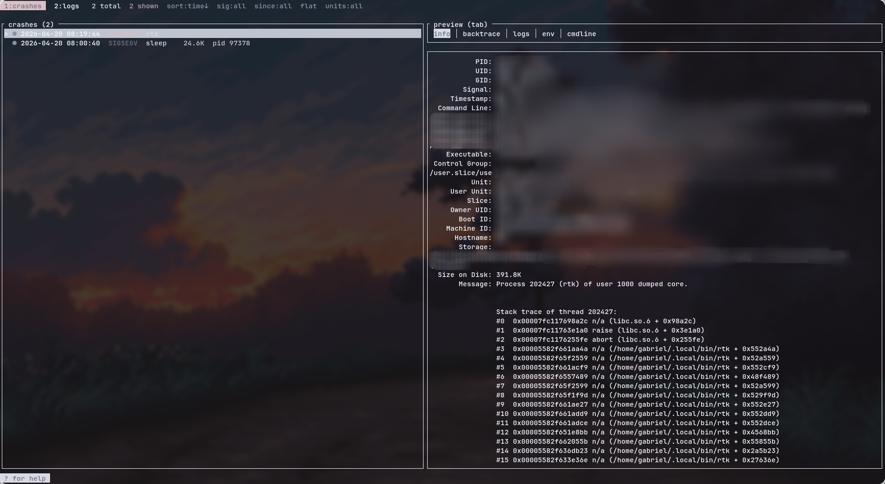

# crashout

[](https://ratatui.rs/)



Linux process debugger in one terminal app: crash browser, log viewer, live
process inspector, and a coredump-notification daemon. Built on top of
`coredumpctl`, `journalctl`, `gdb`, raw `/proc`, and (optionally) `strace`.

Three TUI screens (`1` / `2` / `3`):

- **crashes** — browse past coredumps with signal / time / size / filter /
  group; per-crash tabs: `info`, `backtrace` (async `gdb` batch),
  `logs` (journal ±5min around the crash, colorcoded), `env`, `cmdline`
- **logs** — discover every log source on the box (`/var/log`, `/run/log`,
  `~/.local/share`, `~/.local/state`, `~/.cache`, `~/.config`, every
  `_SYSTEMD_UNIT` source system + user, kernel ring buffer, full journal),
  level-colorize them, pin up to 9 as Alt-switchable buffers, and constrain
  any journal source by `--since` / `--until`
- **procs** — live process list read directly from `/proc` (zero
  subprocesses, polls only while the screen is visible), per-pid sparklines
  for cpu% and rss, detail tabs `status` / `maps` / `fds` / `limits` /
  `environ` / `stream` (on-demand `strace -e trace=write`), kill with
  `K`/`9`

Plus the daemon side:

- Desktop notifications on every new crash (opt-out with `--no-notify`)
- Optional systray icon (StatusNotifierItem) with left-click to open the
  TUI and right-click menu to toggle notifications
- Standalone `crashout log <file>` viewer for one-off log files

Runs entirely as the invoking user — no setuid, no root by default.
Cross-process detail tabs (`maps`, `fds`, `environ`) and `strace` will
show "permission denied" for processes you don't own; that's the kernel,
not us.

## Install

```sh
cargo install --path .
```

Binary lands at `~/.cargo/bin/crashout`. Make sure that's on your `$PATH`.

## Usage

```sh
crashout                    # default: notification daemon (foreground)
crashout --no-notify        # daemon, stderr-only
crashout --tray             # daemon + systray icon
crashout tui                # open the interactive 3-screen TUI
crashout list               # print coredump list as JSON
crashout log <path>         # open a single log file with level colorcoding
```

The default-no-arg behavior is the watch daemon — that's what you want as a
systemd user service. To poke around interactively, use `crashout tui`.

## Daemon (systemd user service)

A service file is shipped in `contrib/systemd/`:

```sh
install -Dm644 contrib/systemd/crashout.service \
    ~/.config/systemd/user/crashout.service
systemctl --user daemon-reload
systemctl --user enable --now crashout.service
```

Default `ExecStart` is `crashout --tray`. Remove `--tray` if you don't
want the tray icon, or add `--no-notify` if you only want the stderr log.

## TUI keybinds

### Global

| Key      | Action                                 |
|----------|----------------------------------------|
| `1`      | switch to the crashes screen (default) |
| `2`      | switch to the logs browser             |
| `3`      | switch to the procs inspector          |
| `?`      | help overlay (any key to close)        |
| `q`      | quit                                   |

### Crashes screen

| Key            | Action                                                     |
|----------------|------------------------------------------------------------|
| `j`/`k` `↓`/`↑`| navigate list (list mode) or scroll preview (detail mode)  |
| `g` / `G`      | top / bottom                                               |
| `PgUp`/`PgDn`  | scroll preview                                             |
| `tab` / `S-tab`| cycle preview: `info` → `backtrace` → `logs` → `env` → `cmdline` |
| `enter`        | list → detail fullscreen, detail → `coredumpctl debug` (gdb) |
| `esc`          | detail → list, list → quit                                  |
| `o`            | dump core to `./core.<pid>`                                 |
| `S`            | save report to `crashout-<pid>-<ts>.txt`                    |
| `x`            | delete the corefile on disk                                 |
| `e`            | `xdg-open` the directory of the crashed binary              |
| `/`            | filter by exe name                                          |
| `s`            | cycle sort: `time↓` / `time↑` / `exe` / `sig` / `size↓`     |
| `m`            | toggle group-by-exe                                         |
| `f`            | cycle signal filter                                         |
| `t`            | cycle since filter: `all` / `1h` / `1d` / `1w` / `boot`     |
| `u`            | toggle only-failed-units                                    |
| `y` then p/e/g/i | yank pid / exe / gdb-cmd / info to clipboard              |
| `r`            | manual reload (auto-reloads every 2s)                       |

### Logs screen

| Key              | Action                                              |
|------------------|-----------------------------------------------------|
| `j`/`k` `g`/`G`  | navigate sources (browser) or lines (fullscreen)    |
| `PgUp`/`PgDn`    | scroll preview                                      |
| `enter`          | browser → fullscreen, fullscreen → open in `$EDITOR`|
| `esc`            | fullscreen → browser, browser → quit                |
| `/`              | filter sources                                      |
| `r` / `R`        | rescan all sources / refresh current preview        |
| `b` / `d`        | pin / unpin current source as a buffer (max 9)      |
| `Alt+1..9`       | jump to pinned buffer N                             |
| `F` / `T`        | set `--since` / `--until` for journal sources       |

### Procs screen

| Key              | Action                                              |
|------------------|-----------------------------------------------------|
| `j`/`k` `g`/`G`  | navigate list (list view) or scroll detail          |
| `PgUp`/`PgDn`    | scroll detail                                       |
| `tab` / `S-tab`  | cycle detail tabs: `status`/`maps`/`fds`/`limits`/`environ`/`stream` |
| `enter`          | list → detail; on `stream` tab: toggle `strace -e write` |
| `esc`            | detail → list (kills any running strace); top-level → quit |
| `/`              | filter by name / pid                                |
| `s`              | cycle sort: `cpu↓` / `mem↓` / `pid↑` / `name`        |
| `K` / `9`        | send SIGTERM / SIGKILL to the selected pid          |
| `y`              | yank pid to clipboard                               |
| `r`              | manual reload (auto every 2s while screen visible)  |

## Requirements

- `systemd` with `systemd-coredump` enabled
  (`systemctl status systemd-coredump.socket`)
- `gdb` (for the backtrace tab)
- `coredumpctl`, `journalctl` on `$PATH`
- `wl-clipboard` / `xclip` / `xsel` for yank
- `strace` (optional) for the procs `stream` tab — needs ptrace permission
  on the target (own user, or `kernel.yama.ptrace_scope=0`, or root)
- A StatusNotifierItem host (Waybar, Plasma, etc.) for the tray
- A terminal on `$PATH` for tray left-click (respects `$TERMINAL`, then
  `xdg-terminal-exec`, then `kitty` / `foot` / `alacritty` / `wezterm` /
  `konsole` / `gnome-terminal` / `xterm`)

## License

MIT
